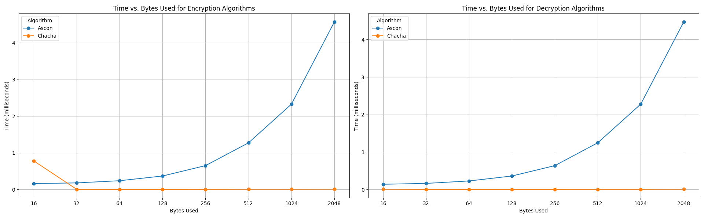

# Implementation of Needham-Schroeder and Two-pass mutual authentication protocol (ISO/IEC 9798-2)

This repository includes a set of scripts for implementing the Needham-Schroeder key establishment protocol as well as a subsequent authentication protocol using Two-pass mutual authentication protocol from ISO/IEC 9798-2.

The scripts allow the use of Ascon or ChaCha20 as ciphers and the use of Ascon or SHA256 as hashing algorithms. 

## Software setup

The program has been developed and tested in an Ubuntu 22.04.3 LTS environment with Python 3.10.12.

### Prerequisites

To execute the different scripts, it is necessary to have previously installed the following libraries:

- `pycryptodome`
- `ascon`
- `requests`

### Script Execution

The scripts are located in the `scripts` directory and must be executed in their own terminal in parallel with the following arguments and in that order, while being consistent by using the same encryption and hash algorithm in all:

- `key_server.py <encryption_algorithm> <hash_algorithm> <log_level>`
- `B.py <encryption_algorithm> <hash_algorithm> <log_level>`
- `A.py <encryption_algorithm> <hash_algorithm> <log_level> <file_to_send>`


The arguments can take the following values:

- **encryption_algorithm:** `ascon` or `chacha`
- **hash_algorithm:** `ascon` or `sha256`
- **log_level:** Number between 0 and 4 (from basic to detailed)
- **file_to_send:** Path and name of the file to send


The scripts `key_server.py` and `B.py` are servers that do not finish their execution and are always listening.

The `A.py` script runs and finishes its execution once the data is sent.

### Example of Execution

Using `chacha` and `sha256`:

```bash
$ python3 key_server.py chacha sha256 2
$ python3 B.py chacha sha256 2
$ python3 A.py chacha sha256 2 ../data_to_send.txt
```


## Symmetric Ciphers

The development of this project includes two different types of ciphers: one stream cipher and one block cipher. Both have been implemented similarly in the application, encapsulated in a function that receives the bytes of data to be encrypted along with the corresponding key to be used. The cipher to be used is selected at the time of executing the script, indicated from the terminal. It is important that all three scripts use the same cipher; otherwise, they will not function correctly. Since the scripts do not have a user interface, enabling a log level of 4 allows the user to observe when data encryption occurs and the resulting ciphertext. 

Similarly, decryption functions have also been implemented that receive the ciphertext, along with the nonce and the key used.

### Stream Cipher

The stream cipher algorithm included is ChaCha20, imported from the PyCryptodome library. This cipher requires the use of keys that are 32 bytes long.

### Block Cipher

The  block cipher algorithm included is Ascon, imported from the Ascon library. This cipher requires the use of keys that are 16 bytes long.


## Comparison of Encryption Algorithms

For this comparison, new functions have been created to measure exclusively the time required for encryption, excluding the time for other operations such as obtaining random bytes for the nonce.

Following this, a script has been developed that displays the milliseconds required by each algorithm for the specified number of bytes (from 16 to 2048 bytes in increments of x2) in a graph for both encryption and decryption.



**Figure 1: Comparison of Encryption Algorithms**

As it can be observed, for both encryption and decryption, except for 16 bytes, ChaCha20 (stream cipher) is clearly faster than Ascon (block cipher) in all other cases, as the former follows a linear growth scale while the latter follows a logarithmic scale.

The comparion test script can be found in the `scripts` directory and can be executed using the following command:

```bash
$ python3 test.py
```

## Hash Algorithms

It is also included the calculation of the hash of the data that will subsequently be encrypted. This way, once the data is decrypted, the hash is recalculated to verify whether the received data has been tampered with or not received correctly.

The implemented hash algorithms are **SHA-256** and **Ascon**. These can be selected when executing the scripts, and all scripts must be run with the same hash algorithm.


## Key Establishment Protocol

The key establishment protocol will be conducted using a trusted server. For this purpose, the Needham-Schroeder protocol (symmetric key) has been implemented.

Before beginning the establishment process, it is assumed that the server has pre-established and stored the keys K<sub>AS</sub> and K<sub>BS</sub>, A has the pre-established and stored key K<sub>AS</sub>, and B has the pre-established and stored key K<sub>BS</sub>. The keys K<sub>AS</sub> and K<sub>BS</sub> are either 16 or 32 bytes long, depending on the cipher being used, as will be the new key K<sub>AB</sub> established.

Considering these keys, the key establishment process proceeds as follows:

- A contacts the key server (Step 1).
- A receives information from the key server (Step 2).
- A decrypts that information and begins communicating with B until the key is established (Steps 3, 4, and 5).

In all steps, the verifications established in the protocol are performed, such as the verification of the received nonces.

## Mutual Authentication Protocol

The mutual authentication protocol assumes that A and B have already established a session key between them using the previous protocol. For this purpose, the Two-pass Mutual Authentication Protocol included in ISO/IEC 9798-2 has been implemented.

This protocol requires two steps:

1. The process begins with A contacting B, indicating its current timestamp and B's ID, all encrypted with the previously established key. B receives this information, decrypts it, and verifies that the ID is correct and that the timestamp was generated no more than 5 seconds ago. If everything checks out, A is successfully authenticated by B.

2. Following this, B will perform the same procedure in reverse, and it will be A that verifies the received information to authenticate B.

## Data Transmission

The objective of this project is to obtain the data of a file by A, which must be sent to B. Once the key has been established between both devices and they have been authenticated, the process of sending the bytes corresponding to the file begins. These bytes are encrypted using the cipher algorithm chosen when executing the script.

On B, the data is received and decrypted back to its original format. Subsequently, the data is displayed on the screen. The reception of the data only occurs if it is received within a maximum of 10 seconds after authentication.


